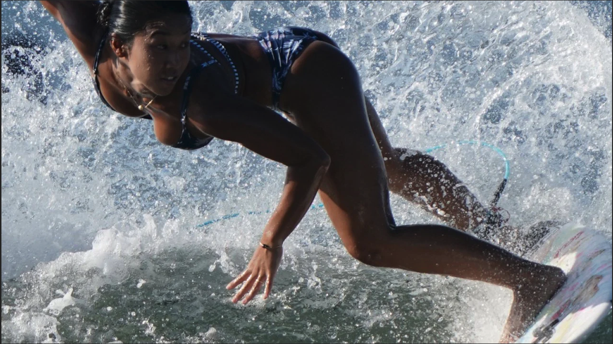

+++
date = '2025-05-08T23:32:42-07:00'
draft = true
title = 'Post_3'
+++

## Introduction

This is **bold** text, and this is *emphasized* text.

Visit the [Hugo](https://gohugo.io) website!

<!-- Image that will open in a modal when clicked -->

  

<!-- Modal Structure -->

  &times;
  
  

